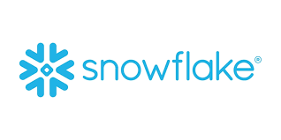
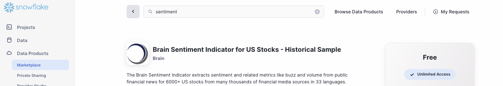
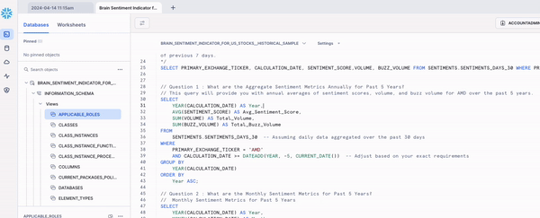

<h1 align="center">Snowflake SQL - AMD Sentiment Analysis Score</h1>

  

<body>
<body style="background-color: #f0f0f0;">

  
  
  
  
  

  <h2>Authors</h2>
  <ul>
    <li><a href="https://github.com/dsrichard97">@dsrichard97</a></li>
  </ul>

    

  <h2>Table of Contents</h2>
  <ul>
    <li><a href="#business-problem" target="_parent">Business Problem</a></li>
    <li><a href="#data-source">Data Source</a></li>
    <li><a href="#methods">Methods</a></li>
    <li><a href="#tech-stack">Tech Stack</a></li>
    <li><a href="#quick-glance">Quick glance at the Results</a></li>
    <li><a href="#lesson-learned">Lessons learned and Recommendation</a></li>
    <li><a href="#limitation">Limitation and what can be Improved</a></li>
  </ul>

  <section id="business-problem">
    <h2>Business Problem</h2>
    

      Leverage Brain’s proprietary automated analysis of financial news flow to gain a deeper understanding of the dynamic factors driving investor sentiment towards AMD.
    

    <h2>Brain Sentiment Indicator Source</h2>
    

      
      The Brain Sentiment Indicator extracts sentiment and related metrics like buzz and volume from public financial news for 6000+ US stocks from many thousands of financial media sources in 33 languages.
The sentiment scoring technology is based on a combination of various natural language processing techniques. The sentiment score assigned to each stock is a value ranging from -1 (most negative) to +1 (most positive) that is updated with a daily frequency. For each stock the sentiment score corresponds to the average of sentiment for each piece of news and it is available on two time scales; 7 days and 30 days. Additional fields measuring the number of stories published and the level of attention (buzz) received from financial media are also available. This dataset contains historical data from August 2016 until July 2022 for trial purposes. In production mode the live dataset is updated daily with new files every day within 6am UTC. <a href="https://www.snowflake.com/en/company/overview/about-snowflake/">snowflake</a>
    

  </section>

  <section id="data-source">
    <h2>Data Source</h2>
     
 Datasource comes from an embedded datasource product that is free under snowflake products. The specific data product comes from 'BRAIN'. Brain has serveral products within the Data products. For more information, it essential to create a account and look for: " Brain Sentiment Indicator for US Stocks - Historical Sample". 

  </section>

  <section id="methods">
    <h2>Methods</h2>
    <ul>
      <li>SQL Code</li>
      <li>Finance Data</li>
      <li>Snowflake</li>
  </section>

  <section id="quick-glance">
    <h2>Quick Glance at the Results</h2>

      

    

  
  
Data Type

<body>
    <h2>SQL Code Snippet:</h2>
    <!-- Code block for copying -->
    <pre>
        // Question 1 : What are the Aggregate Sentiment Metrics Annually for Past 5 Years? 
// This query will provide you with annual averages of sentiment scores, volume, and buzz volume for AMD over the past 5 years.
SELECT 
    YEAR(CALCULATION_DATE) AS Year,
    AVG(SENTIMENT_SCORE) AS Avg_Sentiment_Score,
    SUM(VOLUME) AS Total_Volume,
    SUM(BUZZ_VOLUME) AS Total_Buzz_Volume
FROM 
    SENTIMENTS.SENTIMENTS_DAYS_30  -- Assuming daily data aggregated over the past 30 days
WHERE 
    PRIMARY_EXCHANGE_TICKER = 'AMD'
    AND CALCULATION_DATE >= DATEADD(YEAR, -5, CURRENT_DATE())  -- Adjust based on your exact requirements
GROUP BY 
    YEAR(CALCULATION_DATE)
ORDER BY 
    Year ASC;
    </pre>
    <pre>
        // Question 2 : What are the Monthly Sentiment Metrics for Past 5 Years?
//  Monthly Sentiment Metrics for Past 5 Years
SELECT 
    YEAR(CALCULATION_DATE) AS Year,
    MONTH(CALCULATION_DATE) AS Month,
    AVG(SENTIMENT_SCORE) AS Avg_Sentiment_Score,
    SUM(VOLUME) AS Total_Volume,
    SUM(BUZZ_VOLUME) AS Total_Buzz_Volume
FROM 
    SENTIMENTS.SENTIMENTS_DAYS_30
WHERE 
    PRIMARY_EXCHANGE_TICKER = 'AMD'
    AND CALCULATION_DATE >= DATEADD(YEAR, -5, CURRENT_DATE())
GROUP BY 
    YEAR(CALCULATION_DATE),
    MONTH(CALCULATION_DATE)
ORDER BY 
    Year ASC,
    Month ASC;
    </pre>
    <pre>
        // Question 3 : Give me a daily detailed view?
//  Dive deep into a particular year to see daily sentiment metrics, you could use a query like
SELECT 
    CALCULATION_DATE,
    SENTIMENT_SCORE,
    VOLUME,
    BUZZ_VOLUME
FROM 
    SENTIMENTS.SENTIMENTS_DAYS_30
WHERE 
    PRIMARY_EXCHANGE_TICKER = 'AMD'
    AND YEAR(CALCULATION_DATE) = 2022  -- Specify the year of interest
ORDER BY 
    CALCULATION_DATE ASC;
    </pre>
    
Copy the above SQL code snippet to query data onto your snowflake data query.

</body>

<body>
  <h3>SQL Code</h3>
  
</body>

<body>
  <h3>SQL Code Results</h3>

</body>

<body>
    <h3>Tableau Dashboard</h3>
  

    Click on image to link
  

  
</body>

<b>Visualizations: The goal is to craft compelling narratives for stakeholders. </b>
          <li> I utilized R and Python programming to analyze and reveal patterns of crime, delving into the complex relationship between geographic locations and time to highlight less explored aspects of urban crime. Through geospatial analysis, I identified crime hotspots and patterns at a micro-level, effectively pinpointing critical areas needing attention. The reports I crafted aim to provide actionable insights, enabling targeted strategic interventions.

My analysis of Chicago's 2022-2023 crime data spotlighted the top five crimes, showcasing my capability to simplify complex datasets into clear, actionable insights. This work not only brought to light prevalent crime trends, such as deceptive practices, but also employed sophisticated techniques like K-means clustering in Python for a comprehensive analysis of crime across a wider scope. This effort demonstrates my technical prowess, innovative problem-solving approach, and strategic thinking in crime prevention and safety.
          </li>
        </ul>

  <section id="lesson-learned">
  <h2>Lessons Learned and Recommendation</h2>
  

   I realized that real-time data is ever more necessary for sharing real-time results. Database is updated by the Chicago I.T. department, however, to solve real-case issues and helping law enforcments need to have acess to real time data. As data becomes more accessible for people through various mediums and networks then it is ever more important to have scanners for online crimes and fradualant crimes. Cybersecuirty will be more important than ever. I did use Python and R code to request retrievals for infromation that highlights important crime in the community and so from a geographical perspective this is a good lead for others to be aware about prevailing crimes. I learned in addition that databases needs more security since a lot of imformation can be immediately downloaded from online social media platforms that leave essentially footprints. In terms of the reports, I could have enhanced by connecting to API's(Live connected data). On the other hand, I learned important tasks for data manipulation and documentating progress. I was able to display work using html that can make it easier for others to replicate my work. I've come to realize the increasing necessity of real-time data for sharing immediate results. The database, maintained by the Chicago I.T. department, is crucial for addressing real-world issues and assisting law enforcement by providing access to up-to-the-minute data. As data becomes more accessible to the public via various platforms and networks, the importance of scanning for online and fraudulent crimes escalates. Consequently, cybersecurity is becoming more critical than ever before.

In summary, I've learned that enhancing database security is imperative, as vast amounts of information can be easily extracted from online social media platforms, leaving digital traces. Regarding my reports, they could have been improved by integrating APIs for live data connections. However, this experience has been instrumental in honing my skills in data manipulation and documenting progress.

  <section id="limitation">
    <h2>Limitations and Areas for Improvement</h2>

Utilizing a free online database from Google BigQuery presented certain challenges, as some data had been pre-processed and sensitive information like actual names and full street addresses were omitted for security reasons. Ideally, in real-world scenarios, data should not be manipulated before conducting analysis and documenting specific alterations. Consequently, this report serves more as a conceptual demonstration rather than an exact representation of reality.

Moreover, dealing with real-world data is inherently more complex, requiring initial data engineering or scraping through frontend scripts to access comprehensive online information, including that from law enforcement databases. In essence, although this report was successful in creating a mock-up scenario, it highlights the significant gap between simulated environments and the intricacies of handling authentic datasets.

  

        <h2>Resources</h2>
        

             <a href="https://csulb-my.sharepoint.com/:p:/g/personal/richard_diazdeleon01_student_csulb_edu/EQnZJ2L5sJxChJji6DqvhL0BfsDbXO467AQWm8Dai6r9XA?e=uS6TA8">PowerPoint</a> 
            <a href="https://popcenter.asu.edu/sites/default/files/learning/60steps/index3f62.html?stepNum=25">Crime Analysis in 60 steps</a> 
            <a href="https://projects.itrcweb.org/gsmc-1/Content/GW%20Stats/5%20Methods%20in%20indiv%20Topics/5%208%20Temporal%20Analysis.htm">Motivation</a> 
            <a href="https://pro.arcgis.com/en/pro-app/latest/help/mapping/time/temporal-data.htm">ArcGIS Pro Time Series Data Store Values</a>
        

    
