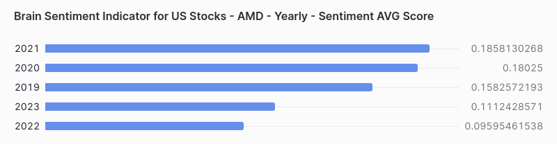
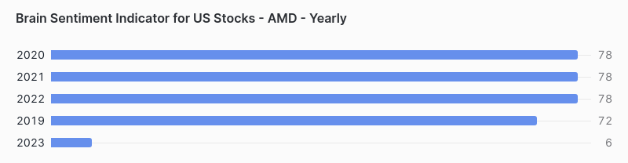

<h1 align="center">Snowflake SQL - AMD Sentiment Analysis Score</h1>

  

<body>
<body style="background-color: #f0f0f0;">

  
  
  
  

  <h2>Authors</h2>
  <ul>
    <li><a href="https://github.com/dsrichard97">@dsrichard97</a></li>
  </ul>

    

  <h2>Table of Contents</h2>
  <ul>
    <li><a href="#business-problem" target="_parent">Business Problem</a></li>
    <li><a href="#data-source">Data Source</a></li>
    <li><a href="#methods">Methods</a></li>
    <li><a href="#tech-stack">Tech Stack</a></li>
    <li><a href="#quick-glance">Quick glance at the Results</a></li>
    <li><a href="#lesson-learned">Lessons learned and Recommendation</a></li>
    <li><a href="#limitation">Limitation and what can be Improved</a></li>
  </ul>

  <section id="business-problem">
    <h2>Business Problem</h2>
    

      Leverage Brain’s proprietary automated analysis of financial news flow to gain a deeper understanding of the dynamic factors driving investor sentiment towards AMD.
    

    <h2>Brain Sentiment Indicator Source</h2>
    

      
    

    

      The Brain Sentiment Indicator extracts sentiment and related metrics like buzz and volume from public financial news for 6000+ US stocks from many thousands of financial media sources in 33 languages.
The sentiment scoring technology is based on a combination of various natural language processing techniques. The sentiment score assigned to each stock is a value ranging from -1 (most negative) to +1 (most positive) that is updated with a daily frequency. For each stock the sentiment score corresponds to the average of sentiment for each piece of news and it is available on two time scales; 7 days and 30 days. Additional fields measuring the number of stories published and the level of attention (buzz) received from financial media are also available. This dataset contains historical data from August 2016 until July 2022 for trial purposes. In production mode the live dataset is updated daily with new files every day within 6am UTC. <a href="https://www.snowflake.com/en/company/overview/about-snowflake/">snowflake</a>
    

  </section>

  <section id="data-source">
    <h2>Data Source</h2>
     
 Datasource comes from an embedded datasource product that is free under snowflake products. The specific data product comes from 'BRAIN'. Brain has serveral products within the Data products. For more information, it essential to create a account and look for: " Brain Sentiment Indicator for US Stocks - Historical Sample". 

  </section>

  <section id="methods">
    <h2>Methods</h2>
    <ul>
      <li>SQL Code</li>
      <li>Finance Data</li>
      <li>Snowflake</li>
  </section>

  <section id="quick-glance">
    <h2>Quick Glance at the Results</h2>

  

  
  
SQL Code

<body>
    <h2>SQL Code Snippet:</h2>
    <!-- Code block for copying -->
    <pre>
        // Question 1 : What are the Aggregate Sentiment Metrics Annually for Past 5 Years? 
// This query will provide you with annual averages of sentiment scores, volume, and buzz volume for AMD over the past 5 years.
SELECT 
    YEAR(CALCULATION_DATE) AS Year,
    AVG(SENTIMENT_SCORE) AS Avg_Sentiment_Score,
    SUM(VOLUME) AS Total_Volume,
    SUM(BUZZ_VOLUME) AS Total_Buzz_Volume
FROM 
    SENTIMENTS.SENTIMENTS_DAYS_30  -- Assuming daily data aggregated over the past 30 days
WHERE 
    PRIMARY_EXCHANGE_TICKER = 'AMD'
    AND CALCULATION_DATE >= DATEADD(YEAR, -5, CURRENT_DATE())  -- Adjust based on your exact requirements
GROUP BY 
    YEAR(CALCULATION_DATE)
ORDER BY 
    Year ASC;
    </pre>
    <pre>
        // Question 2 : What are the Monthly Sentiment Metrics for Past 5 Years?
//  Monthly Sentiment Metrics for Past 5 Years
SELECT 
    YEAR(CALCULATION_DATE) AS Year,
    MONTH(CALCULATION_DATE) AS Month,
    AVG(SENTIMENT_SCORE) AS Avg_Sentiment_Score,
    SUM(VOLUME) AS Total_Volume,
    SUM(BUZZ_VOLUME) AS Total_Buzz_Volume
FROM 
    SENTIMENTS.SENTIMENTS_DAYS_30
WHERE 
    PRIMARY_EXCHANGE_TICKER = 'AMD'
    AND CALCULATION_DATE >= DATEADD(YEAR, -5, CURRENT_DATE())
GROUP BY 
    YEAR(CALCULATION_DATE),
    MONTH(CALCULATION_DATE)
ORDER BY 
    Year ASC,
    Month ASC;
    </pre>
    <pre>
        // Question 3 : Give me a daily detailed view?
//  Dive deep into a particular year to see daily sentiment metrics, you could use a query like
SELECT 
    CALCULATION_DATE,
    SENTIMENT_SCORE,
    VOLUME,
    BUZZ_VOLUME
FROM 
    SENTIMENTS.SENTIMENTS_DAYS_30
WHERE 
    PRIMARY_EXCHANGE_TICKER = 'AMD'
    AND YEAR(CALCULATION_DATE) = 2022  -- Specify the year of interest
ORDER BY 
    CALCULATION_DATE ASC;
    </pre>
    
Copy the above SQL code snippet to query data onto your snowflake data query.

</body>

<body>
  <h3>SQL Results</h3>
  

      
    

    

      
    

</body>

<b>Reports: The goal is to craft a quick sentiment analysis score of AMD. </b>
        <li> I utilized SQL code on snowflakes platform to be able to render reports using inhouse products. There are different versions of in-house products deployed by snowflake that are free and acessible for anyone to use.>

  
This trend could indicate various factors influencing public perception and sentiment towards AMD, such as market performance, company news, product launches, or broader economic conditions. The lower sentiment in 2022 and 2023, for example, might suggest less favorable public opinion or possibly external market factors that influenced investor confidence negatively.

It's important to note that sentiment scores are typically derived from analyzing the language used in news articles, social media posts, and other public communications. These scores are then averaged over a specified period—in this case, annually—to provide a general indication of sentiment towards a company or stock 

</li>
        </ul>

  <section id="lesson-learned">
  <h2>Lessons Learned and Recommendation</h2>
  

The SQL query provided as a reference suggests that these scores are aggregated over a 30-day rolling period leading up to the specific calculation date, and then further analyzed to provide a yearly average. Such a query can help in tracking and analyzing the change in sentiment over time, which can be a valuable component of market analysis and decision-making processes in finance. The future is difficult to predict but with these models its easier to have slighlty better assumptions.

  <section id="limitation">
    <h2>Limitations and Areas for Improvement</h2>

Utilizing a free online database from Google BigQuery presented certain challenges, as some data had been pre-processed and sensitive information like actual names and full street addresses were omitted for security reasons. Ideally, in real-world scenarios, data should not be manipulated before conducting analysis and documenting specific alterations. Consequently, this report serves more as a conceptual demonstration rather than an exact representation of reality.

  

        <h2>Resources</h2>
        

             <a href="https://csulb-my.sharepoint.com/:p:/g/personal/richard_diazdeleon01_student_csulb_edu/EQnZJ2L5sJxChJji6DqvhL0BfsDbXO467AQWm8Dai6r9XA?e=uS6TA8">PowerPoint</a> 
            <a href="https://popcenter.asu.edu/sites/default/files/learning/60steps/index3f62.html?stepNum=25">Crime Analysis in 60 steps</a> 
            <a href="https://projects.itrcweb.org/gsmc-1/Content/GW%20Stats/5%20Methods%20in%20indiv%20Topics/5%208%20Temporal%20Analysis.htm">Motivation</a> 
            <a href="https://pro.arcgis.com/en/pro-app/latest/help/mapping/time/temporal-data.htm">ArcGIS Pro Time Series Data Store Values</a>
        

    
